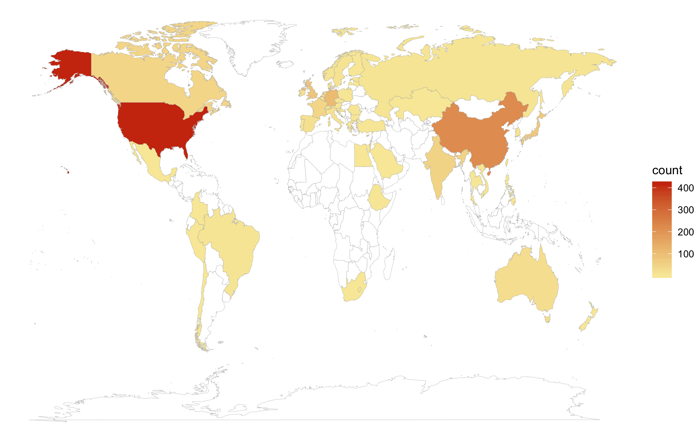

## Writing markdown

Markdown is a lightweight and easy-to-use syntax for styling your writing. It includes conventions for document formatting as in the following examples.

```markdown
Note that this is a code block (enclosed by triple backticks).
Include inline code with single backticks `like this`

You can also make text **Bold** or _Italic_ 

Headers and lists
# Header 1
## Header 2
### Header 3

- Bulleted
- List

1. Numbered
2. List
```


### Tables

```markdown
Colons can be used to align columns.

| Tables        | Are           | Cool  |
| ------------- |:-------------:| -----:|
| col 3 is      | right-aligned | $1600 |
| col 2 is      | centered      |   $12 |
| zebra stripes | are neat      |    $1 |

There must be at least 3 dashes separating each header cell.
The outer pipes (|) are optional, and you don't need to make the 
raw Markdown line up prettily. You can also use inline Markdown.

Markdown | Less | Pretty
--- | --- | ---
*Still* | `renders` | **nicely**
1 | 2 | 3

Both rendered below...
```

| Tables        | Are           | Cool  |
| ------------- |:-------------:| -----:|
| col 3 is      | right-aligned | $1600 |
| col 2 is      | centered      |   $12 |
| zebra stripes | are neat      |    $1 |

Markdown | Less | Pretty
--- | --- | ---
*Still* | `renders` | **nicely**
1 | 2 | 3


### Links and Images

```markdown
[Link](url) and  
e.g. [BBC homepage](https://www.bbc.co.uk)

Both rendered below...
```

e.g. [BBC homepage](https://www.bbc.co.uk)


### Further help

For more details see [GitHub Flavored Markdown](https://guides.github.com/features/mastering-markdown/).

Whenever you commit to this repository, GitHub Pages will run [Jekyll](https://jekyllrb.com/) to rebuild the pages in your site, from the content in your Markdown files.

More info about Pages: check out [the documentation](https://help.github.com/categories/github-pages-basics/) or contact [GitHub support](https://github.com/contact)
